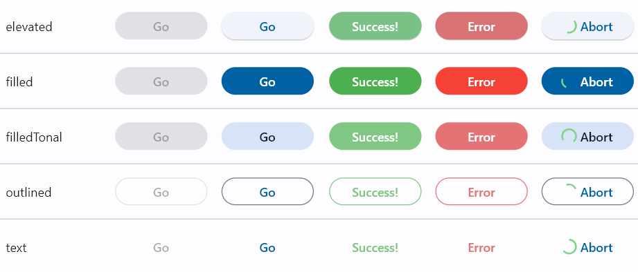

# Future Debounce Button (FDB)
-----
An easy-to-use, all-in-one  button widget for asynchronous calls. Handle futures like a pro: 
keep your code clean and light, bring your UI/UX to the highest standards. Material3 ready.


-----
## Features

A button widget with a very simple implementation that provides complete boilerplate for handling and debouncing of asynchronous requests (API calls etc.). The FDB button handles the future (debounce, abort, block) and updates own state based on the state of that future and other provided parameters.


-----
## Getting started

This button is MVC/MVVM-friendly and is easy to use. The only required parameter is the `onPressed` future. Everything else is optional.

```dart
// A button that handles a future of type `Future<int>`
FutureDebounceButton<int>(
    onPressed: // TODO: (required) a future to handle
    onSuccess: // TODO: (optional) what to do with the result of the future
    onError: // TODO: (optional) your error handler
    onAbort: // TODO: (optional) what to do if the user canceled the request
);
```


## Button Types

The button type can be selected from one of the following values: `elevated`, `filled`, `filledTonal`, `outlined` and `text`. See `buttonType` property of FDB:

| Value | Material Widget |
| :--- |    :----:   |
| FDBType.elevated | ElevatedButton |
| FDBType.filled | FilledButton     |
| FDBType.filledTonal | FilledButton.tonal |
| FDBType.outlined | OutlinedButton |
| FDBType.text | TextButton | 



## States

The button manages its own state based on the state of the future provided to it.
The possible states are:

* __disabled__ - button is either completely disabled, or disabled for the duration of `debounceDuration` value after the button was pressed (see Properties > debounceDuration).
* __ready__ - the button is in its normal "call to action" state. In this state it displays either `actionCallChild` widget, `actionCallText` text, or text __'Go'__ if none of those values are provided.
* __loading__ - the button has been pressed and the future is executing. _The `onAbort` handler is not provided_ to the button. The button in this state displays either `loadingChid` widget, `loadingText` text, or the default [CircularProgressIndicator] widget if none of the former is provided. Clicking on the button in this state does nothing. The button awaits for the future to complete or time out.
* __abort__ - the button has been pressed and the future is executing. _The `onAbort` handler is provided_ to the button. The button in this state displays either `abortChild` widget, `abortTextText` or the default [CircularProgressIndicator] widget with __'Abort'__ text, indicating that the future could be aborted. When the user presses the Abort button - the future is abandoned.
* __success__ - the future has completed with a value. The value is passed to the `onSuccess` handler if one is provided. The button displays either `successChild` widget, `successText` text, or __Success!__ text if none of the former are provided. See the `successStateDuration` property for more options on this state
* __error__ - the future has completed with an error or timed out. The error and the stack trace are passed to the `onError` handler if one is provided. The button displays either `errorChild` widget, `errorText` text, or __Error__ text if none of the former are provided. See the `errorStateDuration` property for more options on this state

-----
## API
The following handlers and properties are available for customization:
## Handlers

The following handlers are available:

| Handler | Required | Description |
| :--- |    :----:   | :--- |
| onPressed | __required__ | a future to handle |
| onSuccess | optional | called when the `onPressed` future has completed with a value. |
| onError | optional | The future has produced an error. The `error` and `stackTrace` objects are passed to the method. |
| onAbort | optional | __If `onAbort` handler is provided, the button becomes "abortable"__ (the future could be abandoned and the possible result is dropped instead of being fed to `onSuccess` handler). If `onAbort` is not provided - the button will lock in the "loading" state until the future completes with success, error, or times out (see `timeout` property). |

## Properties

| Property | Type | Default value | Description |
| :--- |    :----:   |    :----:   | :--- |
|__General__||||
| enabled | bool | true | if `enabled` is false - the button will be disabled |
| buttonType | enum | FDBType.filled | Allows you to choose from one of the five avaliable button widgets. See Button Types above |
|__Ready state__||||
| actionCallChild | Widget? | null | Call to action (`ready`) state widget. This widget is displayed when the button is ready to be pressed. This overrides the `actionCallText` text |
| actionCallText | String?  | null | Displays provided text. Defaults to `Go` if left `null` |
| actionCallButtonStyle | ButtonStyle?  | null | Button style for the `ready`/`disabled` state. Uses theme defaults if left `null` |
|__Loading state__||||
| loadingChild | Widget? | null | Widget to show when the future is running (non-abortable). This overrides `loadingText` text |
| loadingText | String? | null | Text to display when the future is running (non-abortable). Displays [CircularProgressIndicator] widget if left `null` |
| loadingButtonStyle | ButtonStyle? | null | Button style for the `loading` state. Uses theme defaults if left `null` |
|__Abort state__||||
| abortChild | Widget? | null | Widget to show when the future is running (abortable), This overrides `abortText` text |
| abortText | String? | null |  Text to display when the future is running (abortable). Displays [CircularProgressIndicator] widget with __Abort__ text if left `null` |
| abortButtonStyle | ButtonStyle? | null | Button style for the `abort` state. Uses theme defaults if left `null` |
|__Error state__||||
| errorChild | Widget? | null |  Widget to show when the future has failed or timed out. This overrides `errorText` text |
| errorText | String? | null | Text to display when the future has failed or timed out. Displays __Error__ text if left `null` |
| errorButtonStyle | ButtonStyle? | null | Button style for the `error` state. Uses theme internal static style if left `null` |
| errorStateDuration | Duration | 1s | The duration for which the error state is maintained. If `errorStateDuration` is set to `null` - the error state will never clear. If `errorStateDuration` is set to `Duration.zero` - the error state will clear instantly |
|__Success state__||||
| successChild | Widget? | null | Widget to show when the future has completed with a value. This overrides `successText` text |
| successText | String? | null | Text to display when the future has completed with a value. Displays __Success!__ text if left `null` |
| successButtonStyle | ButtonStyle?  | null | Button style for the `success` state. Uses theme internal static style if left `null` |
| successStateDuration | Duration | 1s | The duration for which the error state is maintained. If `successStateDuration` is set to `null` - the success state will never clear. If `successStateDuration` is set to `Duration.zero` - the error state will clear instantly |
|__Debounce and Timeout__||||
| debounceDuration | Duration | 250ms | A delay between the first hit of the button and until the button starts accepting Abort hits (debounce). This is needed to prevent users from double-clicking the button. |
| timeout | Duration? | null | Maximum duration of a future. If `timeout` is set and the time ran out - the FDB will produce [TimeoutException] and port it to `onError` handler if one is provided |

